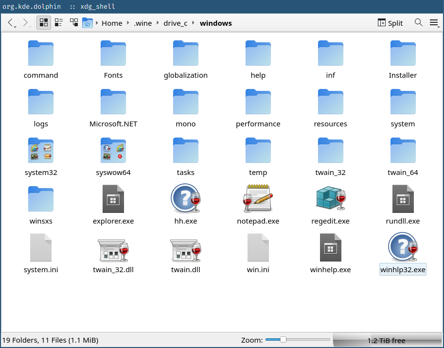

# kio-windows-thumbnails

This is a KIO plugin that provides thumbnails for Windows executables.

## Features

* Relatively efficient: Does not need to read the entire EXE file into memory.
  Reads and parses only what's necessary to determine the icon.

* Support for most common Windows executables:

    * Win16 NE (New Executable)

    * Win32 PE32 (Portable Executable)

    * Win64 PE32+

* Supports classic DIB icons with AND/XOR masks as well as modern PNG icons.

## Background

KDE provides the [KIO Extras](https://invent.kde.org/network/kio-extras) project, which has a thumbnailer for Windows executables. In fact, if you are using Dolphin as your file browser, it's probably enabled for you right now! However, it may or may not be working for you. It wasn't quite working for me, and that's why I'm here.

On Linux, this thumbnailer relies on shelling out to a program called `wrestool`. This solution is rather unsatisfactory: it requires parsing the executable multiple times, multiple forks, regex parsing of CLI output, and it requires the file to be copied to local temporary storage. Worse, this can happen *twice* as it is done both by the KIO layer and internally in icoutils. That's not great.

This code was written a long time ago and ported up through the years, so it's understandable. My desire is to simply make a better thumbnailer and get it merged into KIO Extras. It's that simple.

I do not believe this code is in acceptable state to be merged into KIO Extras. Fundamentally, I'm not even sure if it is acceptable for a PE/NE parser to exist in that codebase, so maybe the PE/NE parsing of this library will need to be made into its own module of some kind that we can make an optional dep of KIO Extras. The goal for this project is to get into that state.

## TODO

* Code cleanup

    * Split into more files: `exeutil.cc` is doing a lot of lifting right now.

    * Better DIB parsing: The DIB parsing code is a joke at the moment. We should do it correctly. Probably, this should be effectively a `QImageIOPlugin`, though maybe not literally.

    * Generally need to improve efficiency, clarity, style, and safety of code across the board.

* Possibly extend `exeutil.cc` to be more general and make it into its own library.

* Look into network transparency.

    * Supposedly, if you set `"X-KDE-Protocol"` to `"KIO"`, you will get the URL to fetch instead of a local file. Unfortunately, in practice, this actually seems to entirely break thumbnailing on remotes rather than do that. This might be an upstream bug as I am unable to find a single other thumbnailer that advertises remote protocol support?

* More executable support?

    * Maybe we can provide thumbnails for LE/LX binaries too.

* Avoid providing thumbnails for DLLs/drivers/etc.

    * These are usually meaningless anyways.
